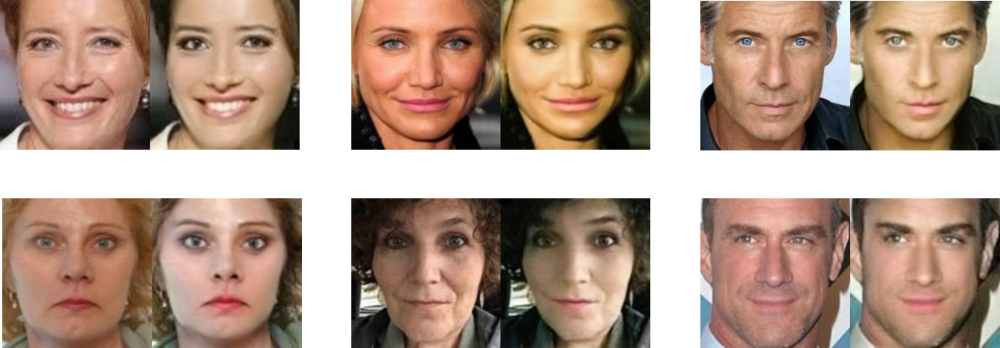
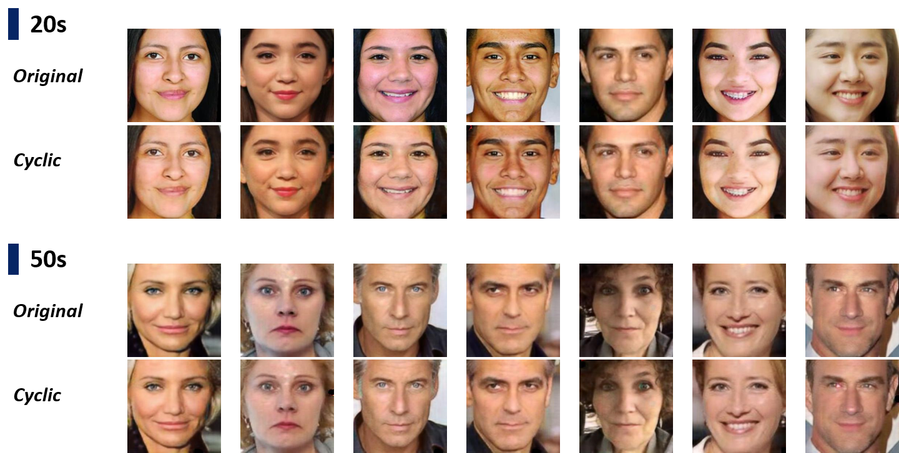

# Face Aging with CycleGAN
This repository is the final result of the project on <B><I>Machine Learning and the Applications</I></B> at Yonsei University.

### Unpaired Image to Image Transition

Source: <a href="https://junyanz.github.io/CycleGAN/" target="_blank">Unpaired Image-to-Image Translation using Cycle-Consistent Adversarial Networks</a>

 The previous image-to-image translation such as Pix2Pix learns the mapping between an input image and an output image with a set of aligned image pairs. However, for many tasks, paired training dataset is unavailable. CycleGAN solves this issue by learning to translate an image from a source domain X to a target domain Y in the absence of paired examples.

### Dataset

Source: <a href="https://susanqq.github.io/UTKFace/" target="_blank">UTKFace - Large Scale Face Dataset</a>

* Consists of 20,000+ face images (Only single face in one image)
* Correspondingly aligned & cropped faces
* Images are labelled by age and gender

### Test Result

   
  <b><I>20s to 50s</I></b>
    
   
  <b><I>50s to 20s</I></b>

### Cycle-Consistency

   

 
<b>Detailed description with PDF file @ <a href="./Face Aging using CycleGAN.pdf" target="_blank">Face Aging using CycleGAN.pdf</a></b>
